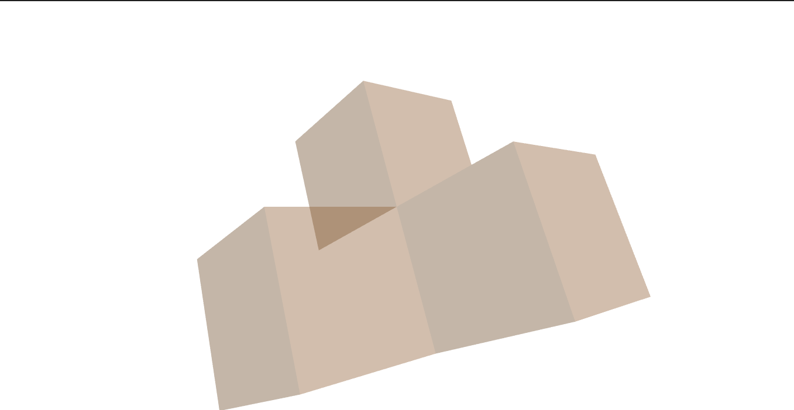
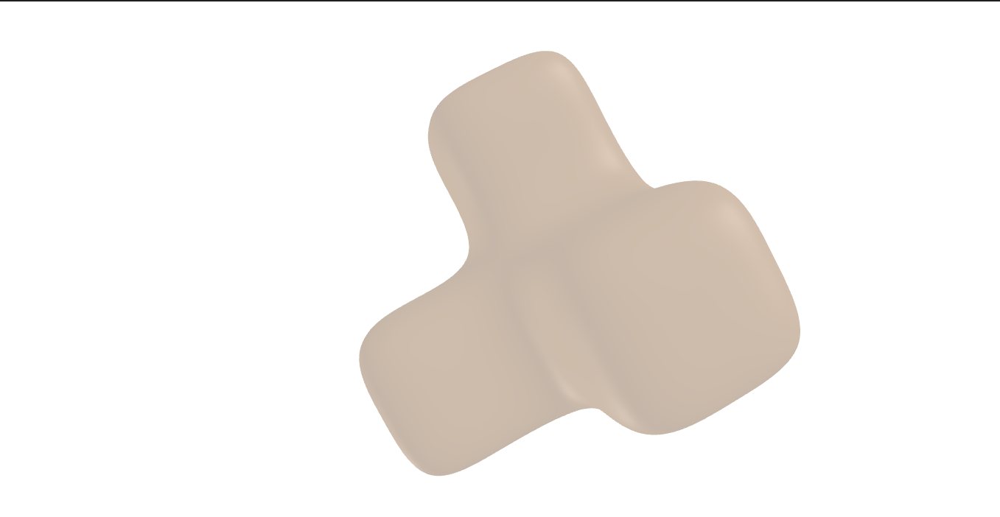
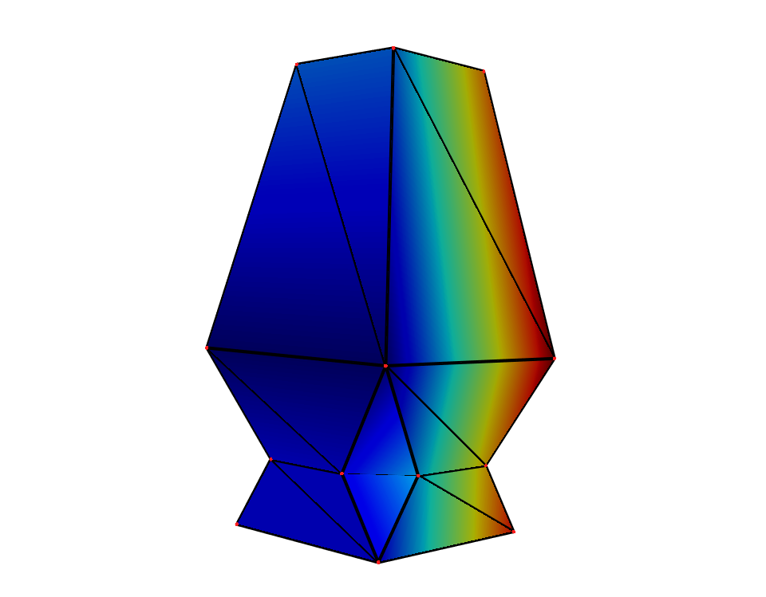
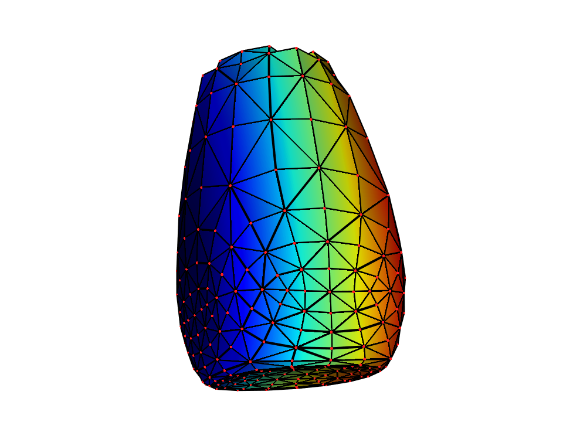

# Subdivision-surface

Solution for Rosetta Code Catmull-Clark subdivision surface task in Python

http://rosettacode.org/wiki/Catmull%E2%80%93Clark_subdivision_surface

cmc.py - my solution to the task

Does not handle holes or faces without 4 points.

Example outputs

inputcube.png - input with no subdivisions
onesubdiv.png - output with one subdivision
twosubdiv.png - two subdivisions
foursubdiv.png - four

## Output
| Before Iteration | After Iteration |
| -------- | -------- |
|  |  |
|  |  |


## Installation
```
pip install -r requirements.txt
```

## Run the command
```
python main.py -h
```
```
usage: main.py [-h] [--mesh MESH] [--iterations ITERATIONS] [--yes-save]
               [--path PATH] [--R R] [--G G] [--B B] [--Opacity OPACITY]

CMC Subdivision

options:
  -h, --help            show this help message and exit
  --mesh MESH           path to mesh file
  --iterations ITERATIONS
                        number of iterations
  --yes-save            save figure as image
  --path PATH           image save path
  --R R                 Red 0-255
  --G G                 Green 0-255
  --B B                 Blue 0-255
  --Opacity OPACITY     Opacity 0-255
```

## [Obj to .ply](https://products.aspose.app/3d/conversion/obj-to-ply)
